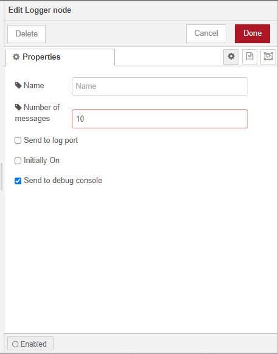

# [node-red-contrib-logger][2]
[Node Red][1] for logging and debugging.

* logger

------------------------------------------------------------

## logger

Defines the client interface to kafka. 

------------------------------------------------------------

# Install

Run the following command in the root directory of your Node-RED install or via GUI install

    npm install node-red-contrib-logger

------------------------------------------------------------

# Version

0.0.1 base

# Author

[Peter Prib][3]

[1]: http://nodered.org "node-red home page"

[2]: https://www.npmjs.com/package/node-red-contrib-logger "source code"

[3]: https://github.com/peterprib "base github"
